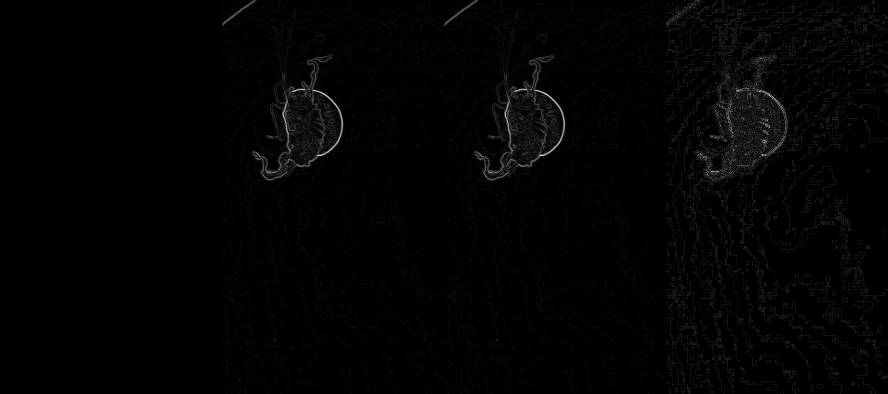

# 🌊 Edge Detection on Underwater Images using OpenCV

This project explores and compares multiple classical edge detection techniques on underwater imagery using OpenCV. The goal is to analyze how different algorithms perform under challenging conditions such as low contrast, noise, and color distortion.

---

## 📌 Overview

Edge detection is a fundamental task in computer vision that identifies boundaries within images. Underwater environments make this task more difficult due to:

* Low visibility and contrast
* Color attenuation (blue/green dominance)
* Noise from suspended particles

This project implements and compares the following methods:

* Canny Edge Detection
* Sobel Operator
* Scharr Operator
* Laplacian Operator

---

## ⚙️ Technologies Used

* Python
* OpenCV
* NumPy
* Matplotlib

---

## 🧠 Methodology

The processing pipeline follows a standard computer vision workflow:

```
Input Image → Grayscale → Gaussian Blur → Edge Detection → Comparison
```

### Steps:

1. **Grayscale Conversion**

   * Reduces image complexity by converting RGB to intensity values.

2. **Gaussian Blur**

   * Removes noise and smooths the image to prevent false edges.

3. **Edge Detection**

   * Multiple algorithms are applied and compared.

---

## 🔍 Edge Detection Techniques

### 1. Canny Edge Detection

* Multi-stage algorithm
* Produces thin and clean edges
* Uses double thresholding and edge tracking

### 2. Sobel Operator

* First-order gradient method
* Detects edges in horizontal and vertical directions
* Produces thicker edges

### 3. Scharr Operator

* Improved version of Sobel
* Provides more accurate gradient estimation
* Better performance in low-contrast regions

### 4. Laplacian Operator

* Second-order derivative method
* Detects edges in all directions
* Sensitive to noise

---

## 📊 Results & Comparison

### Final Comparison Output



### Analysis Summary

| Method    | Edge Quality | Noise Sensitivity | Characteristics               |
| --------- | ------------ | ----------------- | ----------------------------- |
| Canny     | High         | Low               | Thin, clean edges             |
| Sobel     | Medium       | High              | Thick edges, directional      |
| Scharr    | Medium-High  | Medium            | More accurate gradients       |
| Laplacian | Low-Medium   | High              | Noisy, detects all directions |

---

## 🧠 Key Insights

* **Canny** provides the best overall performance for clean edge maps.
* **Scharr** improves gradient accuracy compared to Sobel.
* **Sobel** is useful for understanding directional gradients.
* **Laplacian** is highly sensitive to noise and requires strong preprocessing.

---

## 📁 Project Structure

```
edge-detection-underwater/
├── images/
│   └── sample.jpg
├── outputs/
│   ├── final_comparison.jpg
│   ├── scharr.jpg
│   └── laplacian.jpg
├── src/
│   └── main.py
├── README.md
└── .gitignore
```

---

## 🚀 How to Run

### 1. Clone the repository

```bash
git clone https://github.com/YOUR_USERNAME/edge-detection-underwater.git
cd edge-detection-underwater
```

### 2. Create virtual environment

```bash
python3 -m venv venv
source venv/bin/activate
```

### 3. Install dependencies

```bash
pip install opencv-python numpy matplotlib
```

### 4. Run the project

```bash
python src/main.py
```

---

## 🔧 Future Improvements

* Apply CLAHE for contrast enhancement
* Test on multiple underwater datasets
* Integrate deep learning-based edge detection
* Combine with object detection models

---

## 📌 Conclusion

This project demonstrates how classical edge detection techniques behave under challenging underwater conditions. Among all methods, **Canny Edge Detection** provides the most reliable and visually clean results when combined with proper preprocessing.

---

## 👤 Author

Nafi
Student, BRAC University

---
